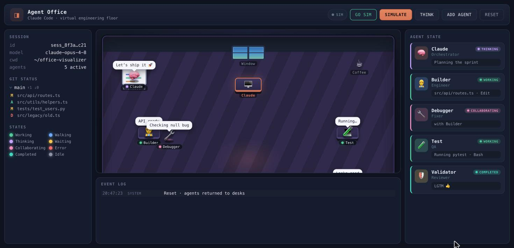

# Agent Office — Claude Code visualizer

[](https://www.npmjs.com/package/claude-agent-office)
[](./LICENSE)
<!-- After pushing to GitHub, replace OWNER/REPO below with your repo path. -->
[](https://github.com/Ecwj11/claude-code-office-visualizer/actions/workflows/ci.yml)

A small virtual engineering office where Claude Code's agents **walk around and
work**. Plain HTML/CSS/JS (no framework, no build step) plus an optional
zero-dependency Node bridge for **live** Claude Code hook events.



## Get it running (for anyone)

Pick whichever fits — all three end at the same office.

**A. Download the zip → double-click a launcher**
1. Unzip anywhere.
2. Just want to watch it? Open `index.html` (works with no install — SIM mode).
3. Want live Claude Code events? Double-click the launcher for your OS — it starts the bridge and opens the office:
   - macOS: `start.command`  · Linux/macOS terminal: `./start.sh`  · Windows: `start.bat`
   - (Live mode needs [Node.js](https://nodejs.org). First run on macOS may need: right-click → Open, to clear Gatekeeper.)

**B. One command with npx** (needs Node)
```bash
npx claude-agent-office     # once published; or `npx .` from the folder
```
Starts the bridge and opens the browser.

**C. Clone the repo**
```bash
git clone <your-repo-url> && cd claude-agent-office
npm start        # bridge + opens browser   (or: node bridge/server.js)
```

To make it react to **real** Claude Code activity, add the hooks (see “Live” below). Without them you still get full SIM mode.

## Two ways to run

### 1. Simulation (no setup)

Just open `index.html` in a browser (double-click works — it uses classic
`<script>` tags, so `file://` is fine). Click **SIMULATE** to play a scripted
"day in the office": Claude plans, spawns Builder / Debugger / Test / Validator,
they walk, collaborate, hit an error, fix it, and return to idle. **RESET**
restores everything.

The pill top-right reads **SIM** in this mode.

### 2. Live (real Claude Code events)

Wire real Claude Code hooks into the office in three steps:

```bash
# 1. Start the bridge (serves the visualizer AND receives hook events)
node bridge/server.js
#    → http://localhost:4319/

# 2. Add the hooks to your Claude Code project (or ~/.claude/settings.json):
#    merge the contents of bridge/claude-settings.example.json into
#    your .claude/settings.json  (see that file — it's ready to paste).

# 3. Open the office and run Claude Code as usual:
open http://localhost:4319/
```

The pill flips to **LIVE** (green) and the office reacts as Claude works: tool
calls sit agents at desks and type; `Task` subagents spawn as new characters
that walk in, work, report back to Claude, and leave.

The hook command is a plain `curl` with a 2s timeout and `|| true`, so it
**never blocks Claude Code** — if the bridge isn't running, the hook is a no-op.

## Event mapping

| Claude Code hook | Office behaviour |
|---|---|
| `SessionStart` | Claude idle at desk |
| `UserPromptSubmit` | Claude → thinking |
| `PreToolUse` (main session) | Claude works at desk, shows tool + target |
| `PreToolUse` (`Task`) | Claude "delegating → \<type\>" |
| `SubagentStart` | new agent walks to a free desk |
| `PreToolUse` / `PostToolUse` (has `agent_id`) | that subagent works / thinks |
| `SubagentStop` | subagent walks to Claude, reports, then leaves |
| `Stop` | Claude idle |

Attribution uses `agent_id` (present only on subagent events) — not
`session_id`, which subagents share with the main session.

## Code layout

```
index.html            shell: Session+Git panel · office · Agent State · Event Log
css/styles.css        theme, furniture, sprite/walk/work animations, cards
js/config.js          states, nav points, waypoint graph, agent roster, tuning
js/nav.js             Dijkstra pathfinding over the waypoint graph
js/agent.js           reusable Agent class — ALL movement logic lives here
js/world.js           rAF movement loop, ambient idle life, event log, reset
js/events.js          SUBAGENT_START / PRE_TOOL_USE / POST_TOOL_USE / SUBAGENT_STOP → behaviour
js/simulation.js      scripted SIMULATE storyboard
js/bridge.js          live mode: SSE client, hook → office mapping
js/main.js            bootstrap + toolbar wiring
bridge/server.js      zero-dep Node bridge (static files + SSE + hook intake)
bridge/cli.js         npx / launcher entry — starts bridge + opens browser
bridge/claude-settings.example.json   hooks to paste into .claude/settings.json
package.json          npm metadata, `npm start`, npx bin
start.command / start.sh / start.bat  double-click launchers (macOS / *nix / Windows)
```

## Extending

- **Add an agent:** push to `AGENT_DEFS` in `js/config.js`, or at runtime
  `OV.Events.emit({ type:'SUBAGENT_START', agent:'x', name:'X', home:'DESK_TEST' })`.
- **Add a place:** add a point to `LOCATIONS` + edges to `EDGES` in `config.js`.
  Furniture is positioned by the same `%` coords in `index.html`.
- **Better pathfinding:** replace `route()` in `js/nav.js` (e.g. A* / nav-mesh);
  nothing else changes.
- **Feed your own events:** call `OV.Events.emit(...)` or POST to
  `http://localhost:4319/hook`.

## CI & releasing (maintainers)

- **CI** (`.github/workflows/ci.yml`): on every push/PR, syntax-checks all JS,
  validates the JSON, and smoke-tests the bridge (serve + `/health` + hook POST)
  across Node 18/20/22.
- **Publish** (`.github/workflows/publish.yml`): cutting a GitHub **Release**
  runs `npm publish`. One-time setup: add a repo secret **`NPM_TOKEN`**
  (npmjs.com → Access Tokens → *Automation*). Then bump `version` in
  `package.json`, tag it, and publish a Release — the package ships automatically.

## Notes

- Movement uses a single `requestAnimationFrame` loop; all timers are tracked
  and cleared on RESET (no leaks). Browsers **freeze rAF in background tabs**,
  so keep the tab focused to watch motion.
- Coordinates are `%` of the office floor, so the layout stays correct as the
  window resizes.
